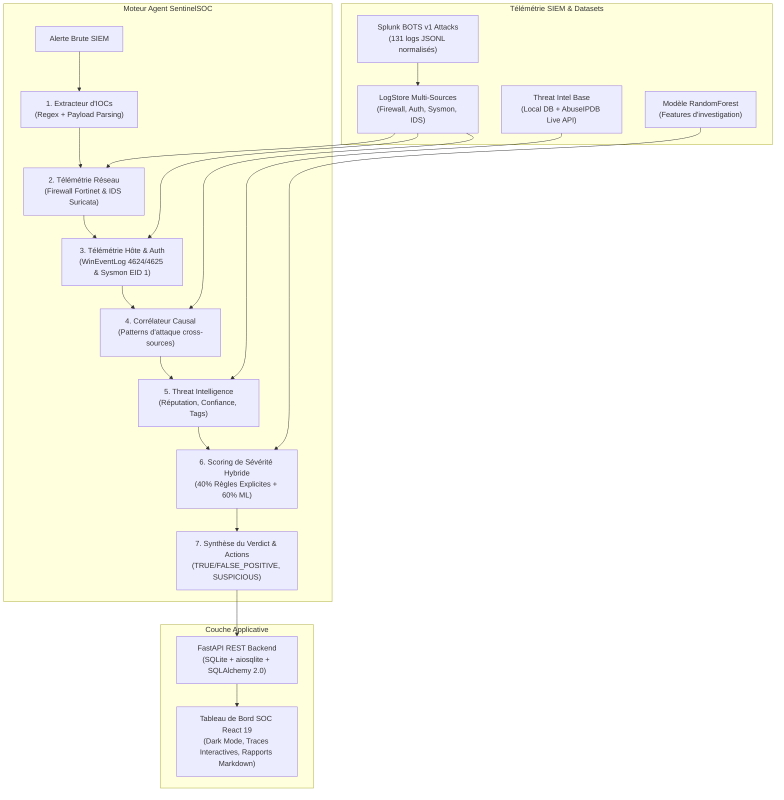

# SentinelSOC 🛡️

**Agent IA Autonome de Triage, Corrélation Multi-Sources & Investigation d'Alertes SOC**

[](https://www.python.org/downloads/)
[](https://fastapi.tiangolo.com/)
[](https://vitejs.dev/)
[-success.svg)](https://docs.pytest.org/)
[](https://opensource.org/licenses/MIT)

---

## 1. Présentation & Positionnement

SentinelSOC est un agent autonome d'investigation de niveau **SOC Tier-2/3**. Il reçoit une alerte brute de sécurité (SIEM/IDS/EDR), extrait automatiquement les indicateurs atomiques (IOCs), interroge la télémétrie multi-sources (pare-feu, authentification Active Directory, processus endpoint Sysmon, IDS Suricata), reconstruit la chaîne causale d'attaque, vérifie la Threat Intelligence, calcule un score de sévérité hybride (Règles + ML) et produit un rapport d'investigation certifié avec actions de remédiation immédiates.

### Positionnement Portfolio

| Projet | Posture | Focus Technique Principal |
|---|---|---|
| **BENIN CYBER SHIELD** | Détection & signalement produit | Ingénierie logicielle full-stack & conformité |
| **FinGuard-NHI** | Gouvernance & Policy pour Agents IA | Sécurité des agents (OWASP Top 10 for LLMs / Non-Human Identities) |
| **SentinelSOC** | **Opérations défensives (Blue Team / SOC)** | **Triage autonome, analyse de logs, corrélation causale, scoring ML & remédiation** |

---

## 2. Architecture Globale



---

## 3. Pipeline d'Investigation Autonome (7 Étapes)

À la réception d'une alerte, SentinelSOC applique systématiquement la méthode d'investigation SOC standardisée :

1. **Extraction des IOCs (`extract_iocs`)** : Parse l'alerte pour extraire adresses IP (IPv4/IPv6), domaines, hachages cryptographiques (SHA256, MD5), comptes utilisateurs (`DOMAIN\user`) et noms d'hôtes.
2. **Télémétrie Réseau & Périmètre (`query_logs`)** : Interroge les flux pare-feu et les signatures IDS associés aux adresses IP sources/destinations pour identifier scans ou communications anormales.
3. **Télémétrie Authentification & Endpoint (`query_logs`)** : Vérifie l'activité du compte utilisateur (Event ID 4624/4625) et l'exécution de processus sur l'hôte (Sysmon Event ID 1 / Tâches planifiées Event ID 106).
4. **Corrélation Cross-Source & Reconstitution Causal (`correlate_events`)** : Détecte des enchaînements multi-sources complexes :
   - `brute_force_followed_by_success`
   - `command_and_control_or_exfiltration` (filtrage strict sur IP publiques routables via `ipaddress`)
   - `reconnaissance_followed_by_execution`
   - `lateral_movement_dual_use_tool` (PsExec, PAExec, WMIC, WinRM + connexions multi-hôtes)
   - `reconnaissance_only`
   - `scheduled_task_triggered_execution` (contexte administratif légitime)
5. **Vérification Threat Intelligence (`lookup_threat_intel`)** : Enrichit les observables externes via la base locale embarquée et l'API live AbuseIPDB.
6. **Scoring de Sévérité Hybride (`score_severity`)** : Combine un moteur de 13 règles déterministes auditables (40%) et un modèle RandomForest (60%) pour calibrer le score [0-100] et la sévérité (`LOW`, `MEDIUM`, `CRITICAL`).
7. **Synthèse du Verdict & Remédiation (`investigation_synthesis`)** : Émet le verdict final (`TRUE_POSITIVE`, `FALSE_POSITIVE`, `SUSPICIOUS`) et formule les actions prioritaires de confinement (`CONTAIN`, `ESCALATE`, `MONITOR`, `IGNORE`).

---

## 4. Benchmark des 8 Scénarios BOTS v1 (Validation 100%)

SentinelSOC est évalué contre une **vérité terrain isolée** (`data/scenarios/ground_truth.json`) non accessible à l'agent lors de l'investigation :

| ID Alerte | Scénario d'Attaque (Splunk BOTS v1) | Verdict Ground Truth | Verdict Agent | Sévérité Calculée | Action Recommandée | Statut |
|---|---|---|---|---|---|---|
| `ALT-2024-001` | **Web Defacement** (Acunetix scan → Webshell → Defacement) | `TRUE_POSITIVE` | `TRUE_POSITIVE` | `CRITICAL` (72.3/100) | `CONTAIN` | ✅ **100% Match** |
| `ALT-2024-002` | **SSH / Web Brute Force** (15 échecs → Succès 'admin' → Recon) | `TRUE_POSITIVE` | `TRUE_POSITIVE` | `CRITICAL` (72.3/100) | `CONTAIN` | ✅ **100% Match** |
| `ALT-2024-003` | **Cerber Ransomware** (USB exec → Shadow copy deletion → C2 185.141.27.88) | `TRUE_POSITIVE` | `TRUE_POSITIVE` | `CRITICAL` (76.1/100) | `CONTAIN` | ✅ **100% Match** |
| `ALT-2024-004` | **Data Exfiltration** (Accès partages sensibles → 7z archive → HTTPS drop 48.5MB) | `TRUE_POSITIVE` | `TRUE_POSITIVE` | `CRITICAL` (76.1/100) | `CONTAIN` | ✅ **100% Match** |
| `ALT-2024-005` | **Port Scanning Interne** (Scan SYN interne 10.0.0.88 sans exécution endpoint) | `SUSPICIOUS` | `SUSPICIOUS` | `MEDIUM` (34.6/100) | `MONITOR` | ✅ **100% Match** |
| `ALT-2024-006` | **Faux Positif PowerShell** (Tâche planifiée Weekly-AD-Maintenance par admin) | `FALSE_POSITIVE` | `FALSE_POSITIVE` | `LOW` (7.2/100) | `IGNORE` | ✅ **100% Match** |
| `ALT-2024-007` | **Mouvement Latéral Ambigu** (PsExec + net user par compte standard sur 2 serveurs) | `SUSPICIOUS` | `SUSPICIOUS` | `MEDIUM` (39.8/100) | `ESCALATE` | ✅ **100% Match** |
| `ALT-2024-008` | **Credential Stuffing OWA** (12 comptes testés depuis IP unique → 2 accès OWA) | `TRUE_POSITIVE` | `TRUE_POSITIVE` | `CRITICAL` (72.3/100) | `CONTAIN` | ✅ **100% Match** |

---

## 5. Rigueur Méthodologique & Garanties Anti-Triche

1. **Isolation de la Vérité Terrain** ([`DECISIONS.md #D007`](file:///home/hasashi/Bureau/SentinelSOC/DECISIONS.md)) : Le fichier `ground_truth.json` est strictement isolé pour les benchmarks post-hoc et n'est jamais interrogé par les outils ou l'agent.
2. **Décision Purement Causale** ([`DECISIONS.md #D008`](file:///home/hasashi/Bureau/SentinelSOC/DECISIONS.md)) : L'agent ne lit aucun identifiant de scénario, titre ou description pour déduire son verdict.
3. **Test de Non-Régression Anti-Triche** : Le test unitaire `test_anti_cheat_no_scenario_id` vérifie qu'une alerte anonymisée sans aucun `scenario_id` produit exactement le même verdict et la même sévérité.
4. **Validation des Adresses IP Publiques** : `is_external_ip` filtre rigoureusement les communications internes (RFC1918, loopback, broadcast) pour éviter de fausser les détections de fuite de données ou C2.

---

## 6. Installation & Démarrage Rapide

### Prérequis
- Python 3.11+
- Node.js 20+ & npm 10+

### Démarrage en 3 commandes

```bash
# 1. Cloner le dépôt
git clone https://github.com/Kreesten-hsh/SentinelSOC.git
cd SentinelSOC

# 2. Installer les dépendances backend & frontend
pip install -e .
cd frontend && npm install && cd ..

# 3. Lancer l'environnement complet (Backend FastAPI + Dashboard React)
chmod +x start.sh
./start.sh
```

- **Dashboard SOC** : [http://localhost:5173](http://localhost:5173)
- **API Swagger / OpenAPI** : [http://localhost:8000/docs](http://localhost:8000/docs)

---

## 7. Exécution des Tests

```bash
# Exécution de la suite complète (74 tests unitaires & intégration)
pytest tests/ -v
```

---

## 8. Structure du Codebase

```
SentinelSOC/
├── backend/                  # API REST FastAPI & Persistance
│   ├── database.py           # Modèles SQLite / SQLAlchemy 2.0 async
│   ├── main.py               # Application FastAPI & Lifespan DB
│   ├── routes/alerts.py      # Endpoints triage, investigation & rapports
│   ├── schemas.py            # Schémas Pydantic pour l'API REST
│   └── services.py           # Orchestration agent & synchronisation DB
├── data/
│   ├── alerts/               # Alertes brutes (sample_alerts.json)
│   ├── investigations/       # Traces JSON générées
│   ├── reports/              # Rapports Markdown & JSON exportés
│   ├── scenarios/            # 8 scénarios de logs normalisés (JSONL)
│   └── threat_intel/         # Base IOCs locale (known_iocs.json)
├── docs/scenarios/           # Fiches d'investigation complètes par scénario
├── frontend/                 # Application React 19 + Vite (Dark Mode SOC)
│   ├── src/
│   │   ├── components/       # Header, Queue, InvestigationTrace, ReportModal
│   │   ├── index.css         # Design System Cyber SOC Vanilla CSS
│   │   ├── api.ts            # Client API REST
│   │   └── types.ts          # Définitions TypeScript
├── models/                   # Modèle ML sérialisé (severity_model.joblib)
├── scripts/
│   ├── generate_scenarios.py # Générateur haute fidélité des logs BOTS v1
│   ├── generate_reports.py   # Générateur de rapports Markdown
│   ├── train_severity_model.py # Entraînement RandomForest & validation croisée
│   └── run_investigations.py # Exécution batch des 8 alertes
├── src/
│   ├── agent/                # Agent smolagents & Prompts SOC
│   ├── data/log_store.py     # Moteur de requêtage de télémétrie
│   ├── models/alert.py       # Schémas typés Pydantic
│   ├── reporting/            # Moteur de génération de rapports Jinja2
│   ├── scoring/              # Moteur de scoring hybride (Règles + ML)
│   └── tools/                # Outils d'investigation (IOC, Query, Correlator, TI)
├── tests/                    # 74 tests unitaires et d'intégration
├── DECISIONS.md              # Registre des décisions d'architecture (D001-D008)
├── pyproject.toml            # Dépendances et configuration projet
└── start.sh                  # Script de démarrage tout-en-un
```

---

## 9. Licence

Projet distribué sous licence MIT. Développé pour des opérations Blue Team & SOC de nouvelle génération.
