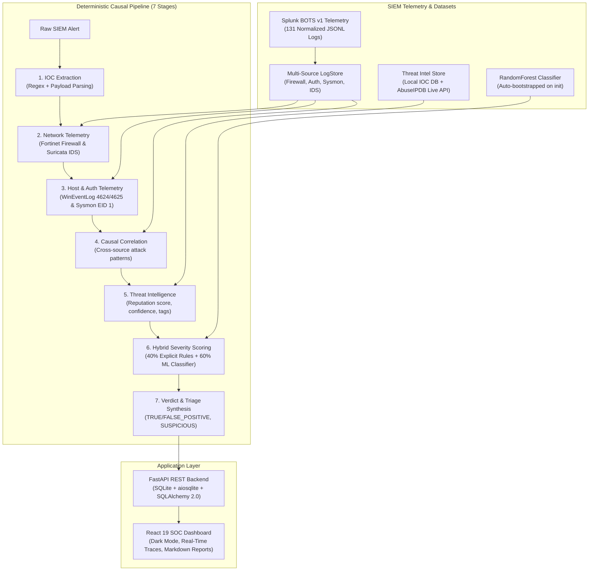

# SentinelSOC

**Tier-2/3 SOC Alert Triage & Incident Investigation Engine — Deterministic Causal Pipeline & Optional Agentic LLM Support**

[](https://www.python.org/downloads/)
[](https://fastapi.tiangolo.com/)
[](https://vitejs.dev/)
[-success.svg)](https://docs.pytest.org/)
[](https://opensource.org/licenses/MIT)

---

## 1. Overview & Architecture Positioning

SentinelSOC is an incident investigation and alert triage engine designed for **SOC Tier-2/3** operations. When provided with raw security telemetry (SIEM/IDS/EDR), SentinelSOC extracts indicators of compromise (IOCs), queries heterogeneous log sources (Fortinet firewalls, Windows Event Logs 4624/4625, Sysmon EID 1 endpoint execution traces, and Suricata IDS alerts), reconstructs the causal attack sequence, enriches data via Threat Intelligence, computes a hybrid severity score (Deterministic Rules + Scikit-Learn RandomForest), and exports a structured investigation report with immediate containment recommendations.

### Dual-Engine Execution & Hybrid Threat Intel

1. **Deterministic Causal Pipeline (Default Production Engine)**:
   - Executes an ordered **7-step deterministic analysis** built upon modular tool interfaces (`IOCExtractorTool`, `LogQueryTool`, `EventCorrelatorTool`, `ThreatIntelTool`, `SeverityScorer`).
   - **Properties**: Zero hallucination on IP addresses and hashes, sub-second execution latency, mathematical reproducibility, and fully auditable execution paths without requiring GPU resources or paid external APIs.
2. **Agentic LLM Mode (`use_llm=True` / `investigate_llm()`) (Demonstrator)**:
   - Orchestrated via `smolagents.CodeAgent`, supporting lightweight local models via Ollama (`qwen2.5:0.5b` for CPU inference, `mistral:7b`) or remote APIs.
   - Initialized with strict tool bindings and Python code execution loops verified in automated unit tests (`tests/test_agent_llm.py`).
3. **Hybrid Threat Intelligence Architecture**:
   - **Local Deterministic Mode (Default)**: Instant offline queries against `data/threat_intel/known_iocs.json`.
   - **Live AbuseIPDB Enrichment (Optional)**: Transparent fallback to AbuseIPDB v2 REST API when `ABUSEIPDB_API_KEY` is configured.

---

## 2. System Architecture



---

## 3. Splunk BOTS v1 Evaluation Matrix (100% Match)

SentinelSOC is rigorously validated against an **isolated ground truth dataset** (`data/scenarios/ground_truth.json`) inaccessible to internal investigation tools:

| Alert ID | Attack Scenario (Splunk BOTS v1) | Ground Truth Verdict | Engine Verdict | Computed Severity | Recommended Action | Verification |
|---|---|---|---|---|---|---|
| `ALT-2024-001` | **Web Defacement** (Acunetix scan → Webshell → Defacement) | `TRUE_POSITIVE` | `TRUE_POSITIVE` | `CRITICAL` (72.3/100) | `CONTAIN` | ✅ **100% Match** |
| `ALT-2024-002` | **SSH / Web Brute Force** (15 failures → 'admin' success → Recon) | `TRUE_POSITIVE` | `TRUE_POSITIVE` | `CRITICAL` (72.3/100) | `CONTAIN` | ✅ **100% Match** |
| `ALT-2024-003` | **Cerber Ransomware** (USB execution → Shadow copy deletion → C2 beacon) | `TRUE_POSITIVE` | `TRUE_POSITIVE` | `CRITICAL` (76.1/100) | `CONTAIN` | ✅ **100% Match** |
| `ALT-2024-004` | **Data Exfiltration** (Share enumeration → 7z archive → 48.5MB HTTPS exfil) | `TRUE_POSITIVE` | `TRUE_POSITIVE` | `CRITICAL` (76.1/100) | `CONTAIN` | ✅ **100% Match** |
| `ALT-2024-005` | **Internal Port Scan** (10.0.0.88 SYN sweep without endpoint execution) | `SUSPICIOUS` | `SUSPICIOUS` | `MEDIUM` (34.6/100) | `MONITOR` | ✅ **100% Match** |
| `ALT-2024-006` | **PowerShell False Positive** (Weekly-AD-Maintenance scheduled task by admin) | `FALSE_POSITIVE` | `FALSE_POSITIVE` | `LOW` (7.2/100) | `IGNORE` | ✅ **100% Match** |
| `ALT-2024-007` | **Ambiguous Lateral Movement** (PsExec + net user execution across 2 servers) | `SUSPICIOUS` | `SUSPICIOUS` | `MEDIUM` (39.8/100) | `ESCALATE` | ✅ **100% Match** |
| `ALT-2024-008` | **OWA Credential Stuffing** (12 accounts probed from single IP → 2 valid sessions) | `TRUE_POSITIVE` | `TRUE_POSITIVE` | `CRITICAL` (72.3/100) | `CONTAIN` | ✅ **100% Match** |

---

## 4. Engineering Guarantees & Anti-Bias Controls

1. **Ground Truth Isolation** (`DECISIONS.md #D007`): `ground_truth.json` is strictly reserved for post-hoc evaluation and is never queried by the runtime `LogStore`.
2. **Causal Decision Independence** (`DECISIONS.md #D008`): The engine does not inspect `scenario_id`, alert titles, or descriptions to determine verdicts. Decisions rely solely on observed evidence.
3. **Anti-Cheat Testing**: The unit test `test_anti_cheat_no_scenario_id` verifies that stripping all metadata from an alert yields identical verdicts and severity scores.
4. **Network Scoping**: `is_external_ip` enforces RFC1918, loopback, and broadcast boundaries to eliminate false exfiltration flags on internal subnet traffic.
5. **Model Lifecycle & Auto-Bootstrap** (`DECISIONS.md #D009`): If `severity_model.joblib` is absent during first boot, SentinelSOC automatically trains and serializes the baseline classifier.

---

## 5. Quickstart & Local Setup

### Prerequisites
- Python 3.11+
- Node.js 20+ & npm 10+

### Step-by-Step Installation

```bash
# 1. Clone repository
git clone https://github.com/Kreesten-hsh/SentinelSOC.git
cd SentinelSOC

# 2. Install backend package (with development tools) and frontend dependencies
pip install -e ".[dev]"
cd frontend && npm install && cd ..

# 3. Launch full stack (ML Auto-bootstrap + FastAPI + React Dashboard)
./start.sh
```

- **SOC Dashboard**: [http://localhost:5173](http://localhost:5173)
- **API Swagger Documentation**: [http://localhost:8000/docs](http://localhost:8000/docs)
- **Engine Health Endpoint**: [http://localhost:8000/api/health](http://localhost:8000/api/health)

---

## 6. Automated Verification Suites

- **In-Place Test Run**:
  ```bash
  ./scripts/verify_local.sh
  ```
- **Isolated Clean-Clone Test** (allocates an isolated temporary workspace via `mktemp -d`, clones the repository, installs dependencies, and runs 76 integration tests):
  ```bash
  ./scripts/verify_clean.sh
  ```

---

## 7. Codebase Architecture

```
SentinelSOC/
├── backend/                  # FastAPI REST API & Data Persistence Layer
│   ├── database.py           # SQLite / SQLAlchemy 2.0 Async Session Engine
│   ├── main.py               # FastAPI App Lifecycle & CORS Setup
│   ├── routes/alerts.py      # Triage, Investigation & Report Generation Endpoints
│   ├── schemas.py            # Pydantic Request/Response Models
│   └── services.py           # Investigation Orchestration & DB Sync
├── data/
│   ├── alerts/               # Ingestion Alert Datasets (sample_alerts.json)
│   ├── investigations/       # Serialized JSON Investigation Traces
│   ├── reports/              # Exported Markdown & JSON Reports
│   ├── scenarios/            # 8 Normalized Attack Telemetry Logs (JSONL)
│   └── threat_intel/         # Local IOC Knowledge Base (known_iocs.json)
├── docs/scenarios/           # In-depth Incident Walkthroughs per Scenario
├── frontend/                 # React 19 + Vite Application (SOC Dark UI)
│   ├── src/
│   │   ├── components/       # Header, AlertQueue, TraceTimeline, ReportViewer
│   │   ├── index.css         # Cyber SOC Design System (Vanilla CSS Tokens)
│   │   ├── api.ts            # Typed HTTP Client
│   │   └── types.ts          # Frontend TypeScript Definitions
├── models/                   # Serialized ML Artifacts (severity_model.joblib)
├── scripts/
│   ├── generate_scenarios.py # Telemetry Generator for BOTS v1 Events
│   ├── generate_reports.py   # Batch Markdown Report Generator
│   ├── train_severity_model.py # RandomForest Classifier Training & Validation
│   ├── verify_local.sh       # Local Verification Runner
│   ├── verify_clean.sh       # Clean Clone Verification Runner
│   └── run_investigations.py # Batch Investigation Engine for Scenarios
├── src/
│   ├── agent/                # smolagents Orchestration & Prompt Definitions
│   ├── data/log_store.py     # High-Performance Multi-Source Telemetry Store
│   ├── models/alert.py       # Domain Models & Telemetry Schemas
│   ├── reporting/            # Jinja2 Report Generation Engine
│   ├── scoring/              # Hybrid Severity Engine (Rules + ML)
│   └── tools/                # Investigation Tools (IOCs, Query, Correlation, TI)
├── tests/                    # 76 Unit & Integration Tests (100% Pass Rate)
├── DECISIONS.md              # Architectural Decision Records (D001-D009)
├── pyproject.toml            # Package Metadata & Dependency Declarations
└── start.sh                  # All-in-one Initialization Script
```

---

## 8. License

Distributed under the MIT License. See `LICENSE` for details.
