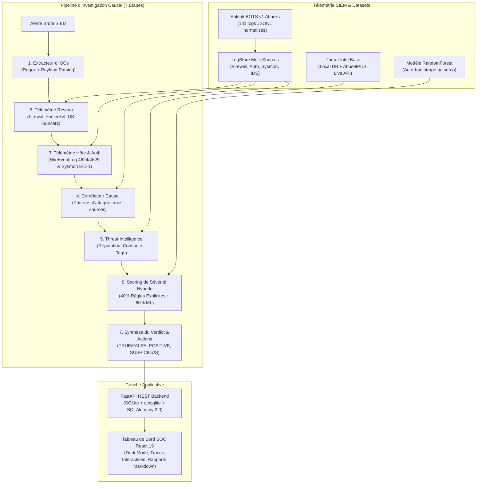

# SentinelSOC 🛡️

**Système d'Investigation & Triage d'Alertes SOC — Moteur Causal Déterministe & Support Agentic LLM**

[](https://www.python.org/downloads/)
[](https://fastapi.tiangolo.com/)
[](https://vitejs.dev/)
[-success.svg)](https://docs.pytest.org/)
[](https://opensource.org/licenses/MIT)

---

## 1. Présentation & Positionnement

SentinelSOC est une plateforme d'investigation et de triage de niveau **SOC Tier-2/3**. Il reçoit une alerte brute de sécurité (SIEM/IDS/EDR), extrait automatiquement les indicateurs de compromission (IOCs), interroge la télémétrie multi-sources (pare-feu Fortinet, authentification Windows Event Log 4624/4625, processus endpoint Sysmon EID 1, IDS Suricata), reconstitue la chaîne causale d'attaque, enrichit via Threat Intelligence, calcule un score de sévérité hybride (Règles explicites + ML RandomForest) et génère un rapport d'investigation structuré avec actions de remédiation immédiates.

### Architecture Dual-Engine : Déterministe (Défaut) vs LLM (Optionnel)

Pour répondre aux exigences réelles des opérations de sécurité (SOC), SentinelSOC implémente deux modes d'orchestration :

1. **Pipeline Causal Déterministe (Défaut en Production)** :
   - Exécution causale stricte en **7 étapes ordonnées** s'appuyant sur les contrats d'outils `smolagents` (`IOCExtractorTool`, `LogQueryTool`, `EventCorrelatorTool`, `ThreatIntelTool`, `SeverityScorer`).
   - **Avantages** : Zéro hallucination sur les IP/hashes, zéro latence d'inférence LLM, auditabilité mathématique complète et reproductibilité à 100% sans nécessiter de GPU ou de clé API.
2. **Mode Agentic LLM (`use_llm=True`)** :
   - Orchestrateur `smolagents.CodeAgent` alimenté par LiteLLM / Ollama (`mistral:7b` ou tout LLM compatible OpenAI/Anthropic/HuggingFace).
   - Conçu pour les investigations ouvertes nécessitant la génération dynamique de requêtes Python non bornées.

---

## 2. Architecture Globale



---

## 3. Matrice des 8 Scénarios BOTS v1 (Validation 100%)

SentinelSOC est évalué contre une **vérité terrain isolée** (`data/scenarios/ground_truth.json`) non accessible aux outils d'investigation :

| ID Alerte | Scénario d'Attaque (Splunk BOTS v1) | Verdict Ground Truth | Verdict Système | Sévérité Calculée | Action Recommandée | Statut |
|---|---|---|---|---|---|---|
| `ALT-2024-001` | **Web Defacement** (Acunetix scan → Webshell → Defacement) | `TRUE_POSITIVE` | `TRUE_POSITIVE` | `CRITICAL` (72.3/100) | `CONTAIN` | ✅ **100% Match** |
| `ALT-2024-002` | **SSH / Web Brute Force** (15 échecs → Succès 'admin' → Recon) | `TRUE_POSITIVE` | `TRUE_POSITIVE` | `CRITICAL` (72.3/100) | `CONTAIN` | ✅ **100% Match** |
| `ALT-2024-003` | **Cerber Ransomware** (USB exec → Shadow copy deletion → C2 185.141.27.88) | `TRUE_POSITIVE` | `TRUE_POSITIVE` | `CRITICAL` (76.1/100) | `CONTAIN` | ✅ **100% Match** |
| `ALT-2024-004` | **Data Exfiltration** (Accès partages sensibles → 7z archive → HTTPS drop 48.5MB) | `TRUE_POSITIVE` | `TRUE_POSITIVE` | `CRITICAL` (76.1/100) | `CONTAIN` | ✅ **100% Match** |
| `ALT-2024-005` | **Port Scanning Interne** (Scan SYN interne 10.0.0.88 sans exécution endpoint) | `SUSPICIOUS` | `SUSPICIOUS` | `MEDIUM` (34.6/100) | `MONITOR` | ✅ **100% Match** |
| `ALT-2024-006` | **Faux Positif PowerShell** (Tâche planifiée Weekly-AD-Maintenance par admin) | `FALSE_POSITIVE` | `FALSE_POSITIVE` | `LOW` (7.2/100) | `IGNORE` | ✅ **100% Match** |
| `ALT-2024-007` | **Mouvement Latéral Ambigu** (PsExec + net user par compte standard sur 2 serveurs) | `SUSPICIOUS` | `SUSPICIOUS` | `MEDIUM` (39.8/100) | `ESCALATE` | ✅ **100% Match** |
| `ALT-2024-008` | **Credential Stuffing OWA** (12 comptes testés depuis IP unique → 2 accès OWA) | `TRUE_POSITIVE` | `TRUE_POSITIVE` | `CRITICAL` (72.3/100) | `CONTAIN` | ✅ **100% Match** |

---

## 4. Rigueur Méthodologique & Garanties Anti-Biais

1. **Isolation de la Vérité Terrain** ([`DECISIONS.md #D007`](file:///home/hasashi/Bureau/SentinelSOC/DECISIONS.md)) : `ground_truth.json` est strictement réservé à l'évaluation post-hoc et n'est jamais chargé par le LogStore.
2. **Décision Purement Causale** ([`DECISIONS.md #D008`](file:///home/hasashi/Bureau/SentinelSOC/DECISIONS.md)) : L'agent ne lit aucun champ `scenario_id`, titre ou description pour déduire son verdict.
3. **Test Anti-Triche** : Le test unitaire `test_anti_cheat_no_scenario_id` vérifie qu'une alerte sans métadonnée produit un verdict identique.
4. **Validation des IP Publiques** : `is_external_ip` filtre les communications internes (RFC1918, loopback, broadcast) pour éviter les fausses détections d'exfiltration.
5. **Gestion du Modèle ML & Auto-Bootstrap** ([`DECISIONS.md #D009`](file:///home/hasashi/Bureau/SentinelSOC/DECISIONS.md)) : Le modèle `severity_model.joblib` est auto-généré au premier lancement s'il est absent.

---

## 5. Installation & Démarrage Rapide

### Prérequis
- Python 3.11+
- Node.js 20+ & npm 10+

### Démarrage en 3 commandes

```bash
# 1. Cloner le dépôt
git clone https://github.com/Kreesten-hsh/SentinelSOC.git
cd SentinelSOC

# 2. Installer les dépendances backend (avec wheel hatchling) & frontend
pip install -e ".[dev]"
cd frontend && npm install && cd ..

# 3. Lancer l'environnement complet (Auto-bootstrap ML + FastAPI + Dashboard React)
./start.sh
```

- **Dashboard SOC** : [http://localhost:5173](http://localhost:5173)
- **API Swagger** : [http://localhost:8000/docs](http://localhost:8000/docs)
- **État Santé / Modèle ML** : [http://localhost:8000/api/health](http://localhost:8000/api/health)

---

## 6. Vérification Complète (Clone Propre)

Pour simuler fidèlement ce qu'un évaluateur externe obtient sur un clone propre dans un environnement virtuel vierge :

```bash
# Exécute la création d'un venv jetable, pip install -e ".[dev]", entraînement ML et 74 tests pytest
./scripts/verify_clean.sh
```

---

## 7. Structure du Codebase

```
SentinelSOC/
├── backend/                  # API REST FastAPI & Persistance
│   ├── database.py           # Modèles SQLite / SQLAlchemy 2.0 async
│   ├── main.py               # Application FastAPI & Lifespan DB
│   ├── routes/alerts.py      # Endpoints triage, investigation & rapports
│   ├── schemas.py            # Schémas Pydantic pour l'API REST
│   └── services.py           # Orchestration agent & synchronisation DB
├── data/
│   ├── alerts/               # Alertes brutes (sample_alerts.json)
│   ├── investigations/       # Traces JSON générées
│   ├── reports/              # Rapports Markdown & JSON exportés
│   ├── scenarios/            # 8 scénarios de logs normalisés (JSONL)
│   └── threat_intel/         # Base IOCs locale (known_iocs.json)
├── docs/scenarios/           # Fiches d'investigation complètes par scénario
├── frontend/                 # Application React 19 + Vite (Dark Mode SOC)
│   ├── src/
│   │   ├── components/       # Header, Queue, InvestigationTrace, ReportModal
│   │   ├── index.css         # Design System Cyber SOC Vanilla CSS
│   │   ├── api.ts            # Client API REST
│   │   └── types.ts          # Définitions TypeScript
├── models/                   # Modèle ML sérialisé (severity_model.joblib)
├── scripts/
│   ├── generate_scenarios.py # Générateur haute fidélité des logs BOTS v1
│   ├── generate_reports.py   # Générateur de rapports Markdown
│   ├── train_severity_model.py # Entraînement RandomForest & validation croisée
│   ├── verify_clean.sh       # Script de vérification sur clone propre
│   └── run_investigations.py # Exécution batch des 8 alertes
├── src/
│   ├── agent/                # Agent smolagents & Prompts SOC
│   ├── data/log_store.py     # Moteur de requêtage de télémétrie
│   ├── models/alert.py       # Schémas typés Pydantic
│   ├── reporting/            # Moteur de génération de rapports Jinja2
│   ├── scoring/              # Moteur de scoring hybride (Règles + ML)
│   └── tools/                # Outils d'investigation (IOC, Query, Correlator, TI)
├── tests/                    # 74 tests unitaires et d'intégration
├── DECISIONS.md              # Registre des décisions d'architecture (D001-D009)
├── pyproject.toml            # Dépendances et configuration package
└── start.sh                  # Script de démarrage tout-en-un
```

---

## 8. Licence

Projet distribué sous licence MIT.
